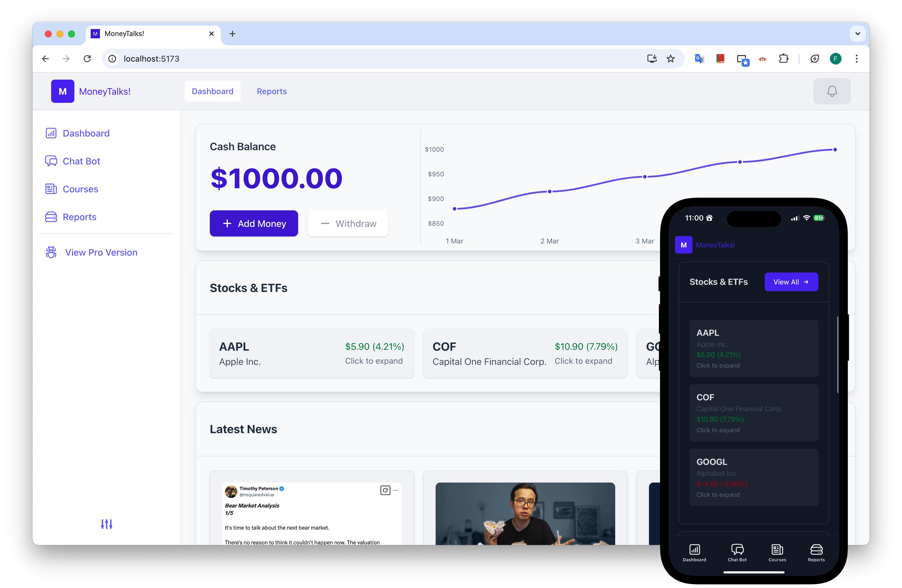
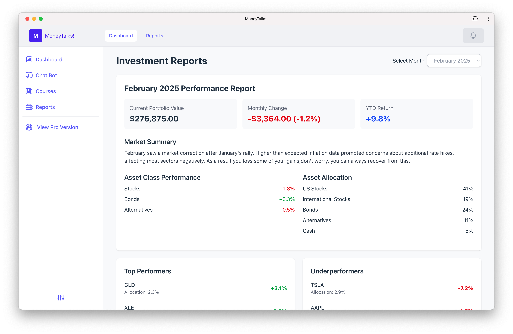
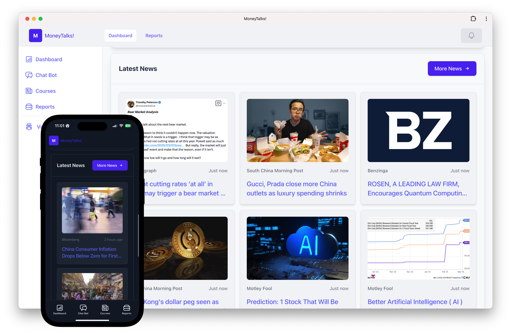
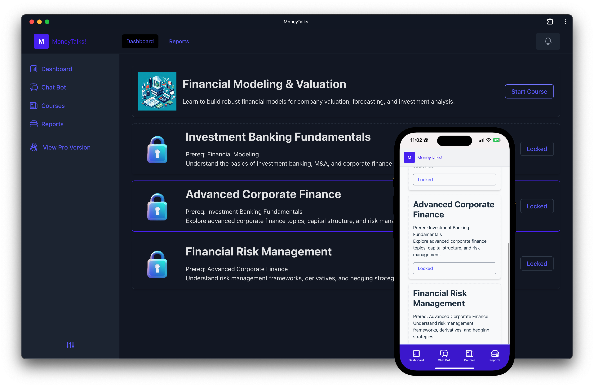
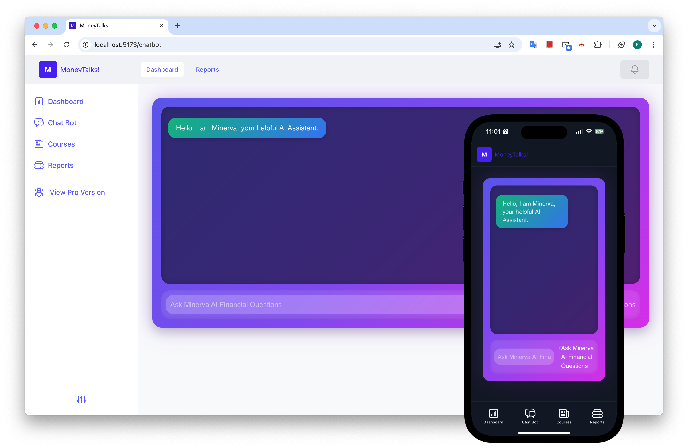
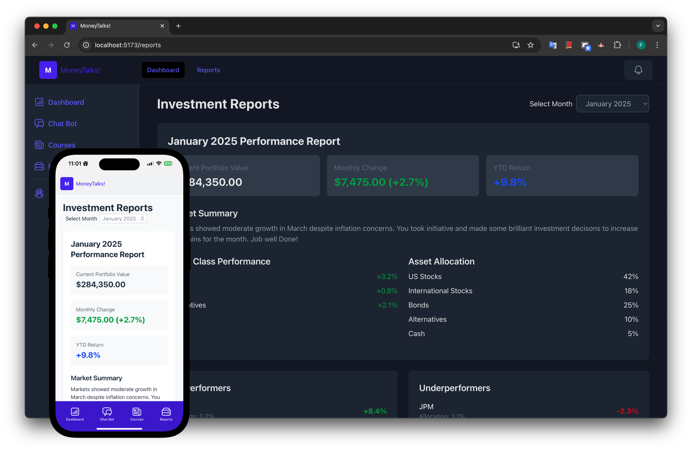

# Money Talk 


## About Us

[MoneyTalk!]() is a financial app that redefines money management by seamlessly blending powerful trading tools with an immersive educational platform to help users master their finances. 

## Our Vision 

We’re here to fix a big problem: financial literacy is often missing from traditional education, leaving many unprepared to save, budget, or invest effectively. Money Talk steps in to make these skills approachable and actionable for all ages.



## Features 

### Cross Platform
Money Talk is designed to work wherever you are. Whether you’re on your phone or at your desk, our app delivers a consistent, user-friendly experience across platforms. 



### Dashboard 
The "Dashboard" feature of Money Talk provides a powerful, cross-platform hub that boldly unites web and mobile interfaces, showcasing your cash balance, stock performance with real-time gains


### Lastest News 
The "Newsletter" feature of Money Talk delivers a dynamic, real-time news hub that keeps users informed with the latest financial insights



### Courses 
The "Courses" feature of Money Talk offers an engaging, tiered educational platform where users can explore a variety of financial topics—from Financial Modeling to Risk Management—unlocking lessons like "Start Course" with a sleek, intuitive interface. This cross-platform experience, seamlessly mirrored on both mobile and web, empowers users to master money management anytime, anywhere with a vibrant and accessible design.




### ChatBot 
The "Chat Bot" feature of Money Talk introduces Minerva, your AI financial assistant, offering a vibrant, cross-platform conversational experience across web and mobile with a sleek purple gradient interface.




### Report 
The "Reports" feature of Money Talk delivers a robust, cross-platform tool that empowers users with detailed investment insights



## Future Innovations

### Crypto Trading and Risk Education

Expanding to include cryptocurrency trading and educational content requires designing intuitive tools while addressing the complexities of crypto volatility and risk management.

### Enhanced Family-Friendly Engagement

Creating more family-oriented features means adapting content and interactions to suit all ages, balancing simplicity for younger users with depth for adults.

## Challenges and Hurdles:

### Implementing a Local AI Model

Integrating a local AI model was challenging due to balancing performance, response times, and infrastructure setup.

### Real-Time News Data APIs 

Accessing real-time news data involved overcoming API limitations and ensuring consistent, accurate data integration.

## Getting Started:

To run the react project run the following in the terminal:

```
git clone https://github.com/bikiris/financial-helper-hack-knight.git
npm install 
npm run dev 
```

* *Note: If you want to use it on other devices run `npm run host` to be able to test it.*

### Accessing Mobile Version:

To access the mobile version that we created utilizing the Progressive Web App Technologies you can add it to the home screen on iOS and Android.

## Technologies:

Here are all the following technologies we leveraged to create [MoneyTalks!](). These technologies come together to create a smooth and interactive financial platform, offering users real-time data visualization, accessibility, and a well-structured UI.

* [Headless UI](https://headlessui.com/) – A set of unstyled, accessible UI components that allow for full customization while maintaining usability. We use it for modals, dropdowns, and other interactive elements.
* [Flowbite ](https://flowbite.com/)  – A Tailwind CSS-based component library that provides pre-styled UI elements, helping us accelerate development while keeping a consistent design.
* [ApexCharts](https://apexcharts.com/) – A powerful charting library used for visualizing financial data. We use it to display trends, analytics, and real-time insights in a visually engaging way.
* [React ](https://react.dev/) – The core JavaScript library that powers our frontend, enabling a seamless and dynamic user experience.
* [Tailwind CSS](https://tailwindcss.com/) – A utility-first CSS framework that allows us to build a responsive, modern, and clean UI efficiently.


## Team:

Here are the talented developers that created this app.

* [Andy Lin](https://www.linkedin.com/in/andy-lin-73ba372b7/): Frontend Developer
* [Anthony Atongi Jr](https://www.linkedin.com/in/anthony-antongi): Full Stack Developer
* [Fedy Cherif](https://www.linkedin.com/in/fedycherif): Full Stack Developer
* [Fengsheng Chen](https://www.linkedin.com/in/fengsheng-chen): Backend Developer

